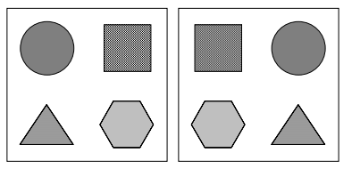

## **Ampliação e redução (zoom)**

Operações de ampliação e redução de imagens aumentam ou diminuem a dimensão das imagens para efeito de visualização. Se o fator de ampliação não for o mesmo para as duas direções a dimensão da imagem será alterada. Para expandir uma imagem em fator 2, converte-se cada pixel em um agrupamento de 4, e para diminui-la nesse mesmo fator, agrupam-se 4 pixels em 1 só. Normalmente, o processo de diminuir uma imagem ocasiona na perda de informação, e, para minimizar esse problema, uma técnica comum é substituir na imagem resultante o valor do pixel pela média dos 4 pixels originais.

## **Alterações de dimensões (_scaling e sizing_)**

Caso nosso objetivo seja a alteração de dimensões da imagem, as técnicas descritas 
acima (zoom) podem ser utilizadas, com a diferença de que a saída será o arquivo contendo a imagem 
alterada (ampliada/reduzida) e não o resultado visual de sua exibição em maior ou menor 
tamanho na tela. A literatura técnica de processamento de imagens por vezes distingue dois 
tipos de alterações de dimensões de uma imagem, embora tecnicamente idênticos: 
1. o processo denominado _scaling_ refere-se ao caso em que a imagem é ampliada ou reduzida 
por um fator (que pode ser igual para as dimensões horizontal e vertical / preservando a 
relação de aspecto original / ou não); 
2. o nome _sizing_ (algumas vezes _resizing_) é utilizado nos casos em que, ao invés de especificar 
o fator de ampliação / redução, o usuário especifica o novo tamanho que a imagem deve 
possuir.

## **Translação**

A translação de uma imagem corresponde ao deslocamento linear de cada pixel de coordenadas `(X, Y)` na horizontal e/ou na vertical, mapeando para o ponto de coordenadas calculado por `{X + ΔX, Y + ΔY}`, onde `(ΔX, ΔY)` é o deslocamento horizontal e vertical, respectivamente.

## **Rotação**

Trata-se do processo de rotacionar uma imagem, em sentido horário ou anti-horário, em um ângulo qualquer. Por exemplo, em rotações de 90º, o processo é realizado apenas copiando as linhas e as posicionando como colunas no sentido que deseja rotacionar, e vice-versa. Para outros ângulos, a rotação de um ponto `(X, Y)` definirá sua posição `(X', Y')`, na imagem rotacionada em um ângulo `a`, através do cálculo:

`X' = X * cos(a) + Y * sen(a)`
`Y' = Y * cos(a) + X * cos(a)`

## **Espelhamento ou Flip**

O flip é o processo de rotacionar em 90º a matriz transposta da imagem (em sentido anti-horário para flip horizontal, em sentido horário para flip vertical). Simplificando, trata-se de espelhar a imagem como no exemplo a seguir:

## **_Warping_**

_Warping_ é o nome dado ao processo de alteração de uma imagem de tal modo que a relação 
espacial entre seus objetos e características é alterada conforme outra imagem ou gabarito 
(template).

## **_Cropping, cutting e pasting_**

Trata-se dos processos de cortar e colar pedaços de imagens para compor novas imagens. Existem três formas de se recortar uma imagem:
1 - Usando uma região retangular definida pelas coordenadas de dois de seus vértices;
2 - Usando uma figura geométrica qualquer, ou um polígono qualquer, regular ou não
3 - Usando um recorte 'à mão livre', usando um mouse ou dispositivo equivalente.
