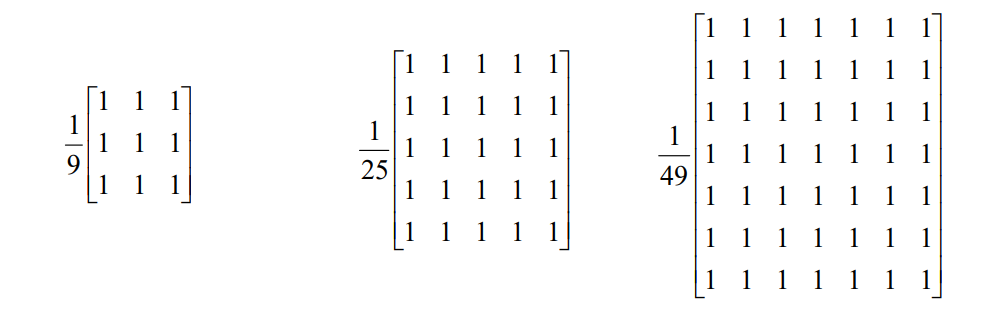
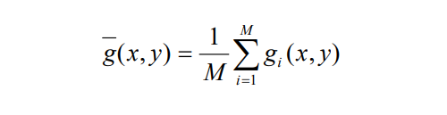

# **Resumo: Suavização de Imagens no Domínio Espacial**

Nesta seção do livro "Processamento Digital de Imagens" de Marques Filho e Vieira Neto, são abordados os tópicos sobre a suavização de imagens no domínio espacial.

O uso de máscaras espaciais no processamento de imagens é normalmente denominado filtragem espacial e as máscaras são conhecidas como filtros espaciais. 

Os filtros são denominados **"passa-baixas"** quando atenuam ou eliminam as componentes de alta frequência no domínio das transformadas de Fourier. Logo, o efeito desse filtro é a de suavizar a imagem, provocando um leve **borramento** dela através do uso de máscaras de convolução.

## **Filtro da Média (Linear)**

Pode ser implementada com a construção de uma máscara 3x3 com todos seus coeficientes iguais a 1, dividindo o resultado da convolução por um fator de normalização, neste caso igual a 9. Deve-se ter em mente que quanto maior o tamanho da máscara, maior o grau de borramento da imagem resultante.

## **Filtro da Mediana (Não-Linear)**

O nível de cinza do pixel central da janela é substituído pela mediana dos pixels situados em sua vizinhança, assim será possível preservar bordas e detalhes finos da imagem.

A mediana m de um conjunto de n elementos é o valor tal que metade dos n elementos do conjunto situem-se abaixo de m e a outra metade acima de m. Quando n é ímpar, a mediana é o próprio elemento central do conjunto ordenado. Nos casos em que n é par, a mediana é calculada pela média aritmética dos dois elementos mais próximos do centro.

## **Filtro da Média de Múltiplas Imagens**

Seja uma imagem ruidosa **g(x,y) = f(x,y)+j(x,y)** onde f(x,y) é a imagem original e j(x,y) é um padrão de ruído aditivo de média zero e descorrelacionado, que se sobrepõe à imagem. Supondo também a existência de M imagens ruidosas, cada qual adquirida em um instante diferente, pode-se calcular uma imagem média na qual a influência do ruído terá sido minimizada: 

Quanto maior for o valor de M, menor a variância dos pixels de g(x,y) e mais a imagem g(x,y) irá se aproximar de f(x,y).

## **Filtro da Média dos k Vizinhos Mais Próximos**

O pixel central da janela é substituído pela média dos k vizinhos cujas amplitudes mais se aproximam da amplitude do pixel central. Portanto, seu objetivo é evitar incluir no cálculo da média valores que possam estar sob a janela em decorrência de bordas ou regiões de alto contraste. Quanto maior o valor de k, mais o desempenho deste filtro se aproximará do filtro da média.