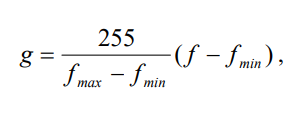
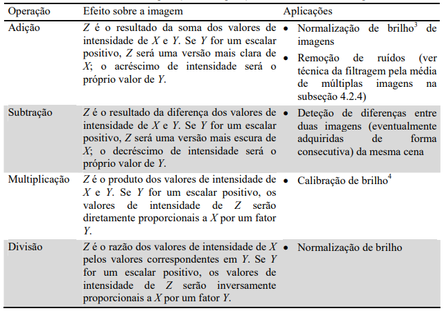
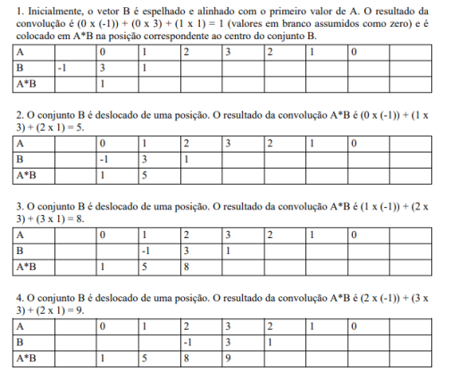

# **Resumo: Operações Lógicas e Aritméticas em Imagens Digitais**

Nesta seção do livro "Processamento Digital de Imagens" de Marques Filho e Vieira Neto, são abordadas as operações lógicas e aritméticas aplicadas a imagens digitais. 

## **Conceitos**

### **Digitalização de uma imagem**

Para digitalizar uma imagem, são realizados os seguintes processos:

- Aquisição
  - Trata-se do processo de conversão de uma cena real e tridimensional em uma imagem analógica, convertendo-a de 3D para 2D.
  
- Digitalização
  - Refere-se ao processo de processar a imagem analógica adquirida e convertê-la em uma matriz MxN, com cada ponto dessa matriz representando um pixel. M e N são diretamente proporcionais à resolução da imagem, e cada pixel dessa imagem assume um valor inteiro de 2 elevado a n - 1, onde n representa o número do nível de cinza da imagem digitalizada.

### **Escala de cinza**

É o intervalo entre a luminosidade mínima e máxima da imagem [Lmín, Lmáx]. Dentro da escala de cinza determinada na imagem, podemos definir o nível/tom de cinza como a intensidade da imagem monocromática em qualquer coordenada (x, y). A maioria dos sistemas de visão artificial usa 256 níveis de cinza.

### **Propriedades de uma imagem digital**

- Vizinhança
  - Um pixel `p` de coordenadas `(x, y)` possui 3 tipos de vizinhaça. A 4-vizinhança `N4(p)`, que são os 4 pixeis adjacentes de `p`: (x-1, y), (x+1, y), (x, y-1) e (x, y+1); A vizinhança diagonal `Nd(p)`, que são os 4 pixels que se encontram à diagonal de `p`: (x-1,y-1), (x-1, y+1), (x+1, y-1), (x+1, y+1) e a 8-vizinhança `N8(p)`, que é a junção das duas anteriores. 

- Conectividade
  - É um importante conceito que ajuda a estabelecer limites a objetos e componentes de determinada região na imagem. Seja `V` um conjunto de valores de **tons de cinza** similares, usados para definir a conectividade. Dado esse conjunto, podemos definir que, para dois pixels `p` e `q` com valores de cinza contidos em `V`:
    - Existe 4-conectividade, caso sejam 4-vizinhos;
    - Existe 8-conectividade, caso sejam 8-vizinhos;
    - Existe conectividade mista, caso `q` seja 4-vizinho de `p` ou `q` seja diagonal a `p` e ambos não compartilhem 4-vizinhos em comum.

- Adjacência
  - Ocorre em dois pixels caso eles sejam conectados. Também pode ocorrer com duas subimagens `S1` e `S2`, caso algum de seus pixels se conecte com o da outra imagem.

- Caminhos
  - É uma sequência de pixels distintos que leva de um pixel `p` a um pixel `q`. O comprimento do caminho é determinado pela quantidade de pixels percorridos para chegar ao pixel `q` determinado.

- Distância
  - Há 3 formas de medir a distância entre dois pixels `p` e `q`, de coordenadas `(x, y)` e `(s, t)`, respectivamente.
    - Distância Euclidiana, que calcula a menor distância entre dois pontos:
    - `D(p, q) = √ ( x - s )² + ( y - t )²`
    - Distância D4, que calcula a distância absoluta entre duas coordenadas:
    - `D(p, q) = | x - s | + | y - t |`
    - Distância D8, que calcula a maior diferença entre qualquer vetor de suas coordenadas:
    - `D(p, q) = max(| x - s |, | y - t |)`

## **Operações Pixel a Pixel**

Após a digitalização, uma imagem é tratada como uma matriz de inteiros e pode ser manipulada numericamente usando operações lógicas ou aritméticas. Estas operações podem ser realizadas de duas maneiras:

- **Operações Pixel a Pixel**: São representadas pela notação **`X opn Y = Z`**, onde **`X`** e **`Y`** podem ser imagens (matrizes) ou escalares, **`Z`** é uma matriz e **`opn`** é um operador aritmético (+, -, *, /) ou lógico (AND, OR, XOR).

## **Operações Aritméticas Pixel a Pixel**

Ao realizar operações aritméticas em imagens, é importante considerar problemas de underflow e overflow. Existem duas alternativas para lidar com esses problemas:

- Manter resultados intermediários em uma matriz que permita valores negativos e/ou maiores que o máximo permitido e, em seguida, normalizar esses valores.

- Truncar valores maiores que o máximo permitido e valores negativos, ajustando-os a 255 e 0, respectivamente.

## **Operações Lógicas Pixel a Pixel**

Todas as operações lógicas, incluindo NOT, podem ser aplicadas a imagens, mesmo quando elas têm múltiplos tons de cinza. Elas são mais compreensíveis quando aplicadas a imagens binárias, mas também podem ser usadas em imagens com vários tons de cinza.

## **Operações orientadas a vizinhança**

As operações lógicas e aritméticas orientadas a vizinhança utilizam o conceito de convolução 
com máscaras (ou janelas ou templates), que será introduzido a seguir e detalhado na próxima 
seção.

## **Operações de convolução com máscaras**

Uma operação de convolução unidimensional entre dois vetores `A` e `B`, denotada por `A * B`, é como montar um vetor que contém os resultados da somas dos produtos de `A` por `B`, onde `B` é espelhado e deslocado sempre de posição para calcular o próximo valor de `A * B`, como na imagem a seguir, que assume A = {0, 1, 2, 3, 2, 1, 0} e B = {1, 3, -1}:

Para matrizes bidimensionais, a ideia é a mesma. A máscara `B` será espelhada na horizontal e na vertical, deslocando-se linha por linha, por todas as linhas, até que percorra toda a matriz imagem `A`. O resultado será uma matriz do mesmo tamanho da matriz original. Para lidar com os pixels restantes, à borda da imagem que recebeu a máscara, podem-se usar muito métodos.
- 1. preencher com zeros o contorno da imagem, de maneira condizente com o tamanho 
de máscara utilizado, como ilustra a figura 18. 
- 2. preencher o contorno da imagem com os mesmos valores da(s) primeira(s) e última(s) 
linha(s) e coluna(s). 
- 3. prevenir a eventual introdução de erros nas regiões de bordas da imagem causados 
por qualquer um dos métodos acima, considerando na imagem resultante apenas os valores para 
os quais a máscara de convolução ficou inteiramente contida na imagem original.

## **Detecção de pontos isolados**

A seguinte máscara é um exemplo de operador de convolução que, quando aplicado a uma imagem, destacará pixels brilhantes circundados por pixels mais escuros. É conhecido por filtro passa-altas.

[filtro](./assets/passa-altas.png)

## **Detecção de linhas**

As máscaras a seguir podem ser utilizadas para a detecção de linhas horizontais e verticais (acima) e diagonais (abaixo).

[filtro 2](./assets/detecta-linhas.png)

## **Detecção de bordas**

Define-se **borda como a fronteira entre duas regiões cujos níveis de cinza predominantes são razoavelmente diferentes.** Podem-se definir bordas de textura e bordas de cor em imagens onde texturas ou a cor, respectivamente, são as mais importantes, mas aqui apenas são tratadas bordas de luminosidade. Para detecção de bordas, são usadas as seguintes máscaras:

[filtro 3](./assets/detecta-bordas.png)

Existe também o **operador laplaciano**, que é definido por:

[operador laplaciano](./assets/laplaciano.png)

E suas máscaras podem ser definidas por:

[mascara laplaciana](./assets/laplaciano-máscara.png)

## **Ampliação e redução (zoom)**

Operações de ampliação e redução de imagens aumentam ou diminuem a dimensão das imagens para efeito de visualização. Se o fator de ampliação não for o mesmo para as duas direções a dimensão da imagem será alterada. Para expandir uma imagem em fator 2, converte-se cada pixel em um agrupamento de 4, e para diminui-la nesse mesmo fator, agrupam-se 4 pixels em 1 só. Normalmente, o processo de diminuir uma imagem ocasiona na perda de informação, e, para minimizar esse problema, uma técnica comum é substituir na imagem resultante o valor do pixel pela média dos 4 pixels originais.

## **Alterações de dimensões (_scaling e sizing_)**

Caso nosso objetivo seja a alteração de dimensões da imagem, as técnicas descritas 
acima (zoom) podem ser utilizadas, com a diferença de que a saída será o arquivo contendo a imagem 
alterada (ampliada/reduzida) e não o resultado visual de sua exibição em maior ou menor 
tamanho na tela. A literatura técnica de processamento de imagens por vezes distingue dois 
tipos de alterações de dimensões de uma imagem, embora tecnicamente idênticos: 
1. o processo denominado _scaling_ refere-se ao caso em que a imagem é ampliada ou reduzida 
por um fator (que pode ser igual para as dimensões horizontal e vertical / preservando a 
relação de aspecto original / ou não); 
2. o nome _sizing_ (algumas vezes _resizing_) é utilizado nos casos em que, ao invés de especificar 
o fator de ampliação / redução, o usuário especifica o novo tamanho que a imagem deve 
possuir.

## **Translação**

A translação de uma imagem corresponde ao deslocamento linear de cada pixel de coordenadas `(X, Y)` na horizontal e/ou na vertical, mapeando para o ponto de coordenadas calculado por `{X + ΔX, Y + ΔY}`, onde `(ΔX, ΔY)` é o deslocamento horizontal e vertical, respectivamente.

## **Rotação**

Trata-se do processo de rotacionar uma imagem, em sentido horário ou anti-horário, em um ângulo qualquer. Por exemplo, em rotações de 90º, o processo é realizado apenas copiando as linhas e as posicionando como colunas no sentido que deseja rotacionar, e vice-versa. Para outros ângulos, a rotação de um ponto `(X, Y)` definirá sua posição `(X', Y')`, na imagem rotacionada em um ângulo `a`, através do cálculo:

`X' = X * cos(a) + Y * sen(a)`
`Y' = Y * cos(a) + X * cos(a)`

## **Espelhamento ou Flip**

O flip é o processo de rotacionar em 90º a matriz transposta da imagem (em sentido anti-horário para flip horizontal, em sentido horário para flip vertical). Simplificando, trata-se de espelhar a imagem como no exemplo a seguir:

[espelhamento](./assets/espelhamento.png)

## **_Warping_**

_Warping_ é o nome dado ao processo de alteração de uma imagem de tal modo que a relação 
espacial entre seus objetos e características é alterada conforme outra imagem ou gabarito 
(template).

## **_Cropping, cutting e pasting_**

Trata-se dos processos de cortar e colar pedaços de imagens para compor novas imagens. Existem três formas de se recortar uma imagem:
1 - Usando uma região retangular definida pelas coordenadas de dois de seus vértices;
2 - Usando uma figura geométrica qualquer, ou um polígono qualquer, regular ou não
3 - Usando um recorte 'à mão livre', usando um mouse ou dispositivo equivalente.