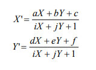
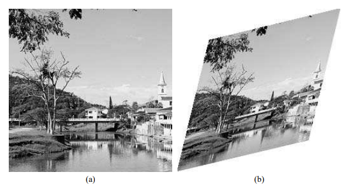

### **_Warping_**

_Warping_ é o nome dado ao processo de alteração de uma imagem de tal modo que a relação 
espacial entre seus objetos e características é alterada conforme outra imagem ou gabarito 
(template).

É baseado na fórmulas de projeção afim (_affine projection_), dada pelas equações:

Onde:
  `(X, Y)` = Coordenada original da imagem
  `(X', Y')` = Nova coordenada da imagem
  `a, b, c, d, e, f, i` e `j` = Coeficientes determinados a partir de um ponto de controle, correspondente à congruência desejada entre a imagem original e o formato desejado.

No exemplo realizado em , temos uma imagem 920x760 sendo convertida em um template losangular, conforme o exemplo a seguir:
