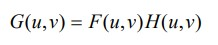
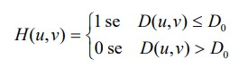
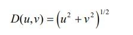
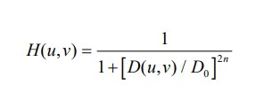
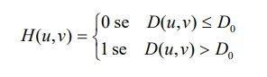
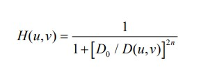
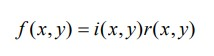

## Filtragem no Domínio Espacial

A filtragem no domínio espacial é uma técnica fundamental em processamento de imagens, que envolve a manipulação direta dos valores dos pixels da imagem original. Nesse contexto, os pixels da imagem são tratados como uma matriz bidimensional, na qual cada elemento representa a intensidade de luz em um ponto específico da imagem.

### **Filtro da média**

O Filtro da Média é uma das técnicas mais simples de filtragem no domínio espacial. Ele suaviza a imagem, reduzindo variações abruptas nos valores dos pixels. Para aplicar o filtro da média, uma janela deslizante (também conhecida como máscara) percorre a imagem, e o valor do pixel central é substituído pela média dos valores dos pixels dentro da janela. Isso ajuda a reduzir o ruído e tornar a imagem mais uniforme.

### **Filtro de mediana**

Nesta técnica, o nível de cinza do pixel central da janela é substituído pela mediana dos pixels situados em sua vizinhança. 

### **Filtro da média dos k vizinhos mais próximos**

Esta técnica, descrita em [Davis e Rosenfeld 1978], consiste em uma variação do método de filtragem pela média, na qual o pixel central da janela é substituído pela média dos k vizinhos cujas amplitudes mais se aproximam da amplitude do pixel central. Seu objetivo é deliberadamente evitar incluir no cálculo da média valores que possam estar sob a janela em decorrência de bordas ou regiões de alto contraste. Quanto maior o valor de k, mais o desempenho deste filtro se aproximará do filtro da média. 

## Filtragem no Domínio da Frequência

A ideia básica dos filtros no domínio da frequência está em computar a Transformada de Fourier (FT) da imagem a ser filtrada, multiplicar este resultado pela função de transferência do filtro e extrair a Inversa da Transformada de Fourier (IFT) do resultado.

### **Filtro passa-baixas (FPB)**

Sendo F(u,v) a transformada de Fourier da imagem a ser processada e sendo G(u,v) a transformada de Fourier da imagem que se deseja obter à saída (com os componentes de alta frequência atenuados), a filtragem passa-baixas consiste em encontrar um H(u,v) tal que:

### **Filtro passa-baixas ideal**

Um filtro passa-baixas 2-D ideal é aquele cuja função de transferência satisfaz a relação:

onde D0 é um valor não-negativo (análogo à frequência de corte de um filtro 1-D), e D(u,v) é a distância do ponto (u,v) à origem do plano de frequência; isto é,

### **Filtro passa-baixas Butterworth**

Um filtro passa-baixas realizável em hardware é o filtro Butterworth. Um filtro Butterworth de ordem n e com frequência de corte a uma distância D0 da origem possui função de transferência dada pela equação:

onde D(u,v) é dado pela equação de distância do ponto (u,v) à origem do plano de frequência.

### **Filtro passa-altas (FPA)**

O objetivo do uso de filtros passa-altas em imagens é o realce de suas regiões de alta frequência, tais como bordas e/ou texturas ricas em variações abruptas de níveis de cinza. Para o projeto de filtros passa-altas no domínio da frequência, aplicam-se as mesmas considerações feitas para os filtros passa-baixas, com a exceção, óbvia, do comportamento em frequência desejado.

### **Filtro passa-altas idea**

Um filtro passa-altas 2-D ideal é aquele cuja função de transferência satisfaz a relação:

onde D0 é a 'distância de corte' do filtro e D(u,v) é a distância do ponto (u,v) à origem do plano de frequência

### **Filtro passa-altas Butterworth**

Um FPA Butterworth de ordem n e com frequência de corte a uma distância D0 da origem possui função de transferência dada pela equação:

A filtragem passa-altas usando um filtro Butterworth apresenta como desvantagem a excessiva atenuação dos componentes de baixa frequência. Este problema é solucionado com a técnica denominada 'ênfase em alta frequência', que consiste basicamente em adicionar uma constante à função de transferência do filtro passa-altas de modo a preservar os componentes de baixa frequência. A técnica de ênfase em alta frequência sozinha não produz um resultado muito melhor que o da filtragem passa-altas convencional. Porém, a aplicação da ênfase em alta frequência seguida da equalização de histograma pode produzir melhores resultados.

## **Filtragem homomórfica**

O modelo iluminância-refletância pode ser usado como base para uma técnica de filtragem no domínio da frequência que é útil para aprimorar a qualidade de uma imagem através da compressão da faixa dinâmica de brilho simultaneamente com o aumento 
de contraste. A formulação matemática dos filtros homomórficos parte da equação que relaciona uma imagem f(x,y) com suas componentes de iluminância e refletância:

