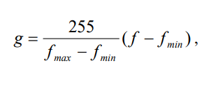
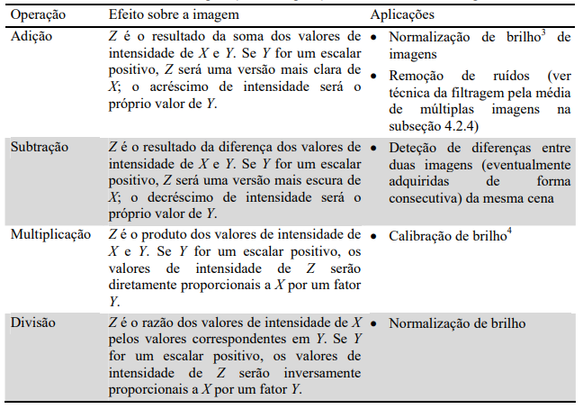

# **Resumo: Operações Lógicas e Aritméticas em Imagens Digitais**

Nesta seção do livro "Processamento Digital de Imagens" de Marques Filho e Vieira Neto, são abordadas as operações lógicas e aritméticas aplicadas a imagens digitais. 

## **Operações Pixel a Pixel**

Após a digitalização, uma imagem é tratada como uma matriz de inteiros e pode ser manipulada numericamente usando operações lógicas ou aritméticas. Estas operações podem ser realizadas de duas maneiras:

- **Operações Pixel a Pixel**: São representadas pela notação **`X opn Y = Z`**, onde **`X`** e **`Y`** podem ser imagens (matrizes) ou escalares, **`Z`** é uma matriz e **`opn`** é um operador aritmético (+, -, *, /) ou lógico (AND, OR, XOR).

## **Operações Aritméticas Pixel a Pixel**

Ao realizar operações aritméticas em imagens, é importante considerar problemas de underflow e overflow. Existem duas alternativas para lidar com esses problemas:

- Manter resultados intermediários em uma matriz que permita valores negativos e/ou maiores que o máximo permitido e, em seguida, normalizar esses valores.

- Truncar valores maiores que o máximo permitido e valores negativos, ajustando-os a 255 e 0, respectivamente.

## **Operações Lógicas Pixel a Pixel**

Todas as operações lógicas, incluindo NOT, podem ser aplicadas a imagens, mesmo quando elas têm múltiplos tons de cinza. Elas são mais compreensíveis quando aplicadas a imagens binárias, mas também podem ser usadas em imagens com vários tons de cinza.