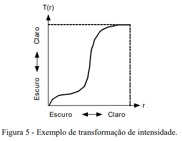

# Transformações de Intensidade

As técnicas de modificação de histograma são conhecidas como técnicas ponto-a-ponto, uma vez que o valor de tom de cinza de um certo pixel após o processamento depende apenas de seu valor original. Em contraste, nas técnicas de processamento orientadas a vizinhança, o valor resultante depende também, de alguma forma, dos pixels que circundam o elemento de imagem original.

Diversas técnicas de modificação da distribuição dos pixels na escala de cinza podem ser implementadas a partir do conceito de transformações de intensidade, apresentado formalmente a seguir.

Seja uma variável 𝑓, representando o nível de cinza dos pixels na imagem a ser processada. Por simplicidade, assumiremos inicialmente que a escala de cinza é normalizada, ou seja, 0 ≤ 𝑓 ≤ 1, onde 𝑓 = 0 representa um pixel preto e 𝑓 = 1 indica pixel branco.

Para qualquer 𝑓 no intervalo [0, 1], denominaremos transformações de intensidade as funções do tipo 𝑔 = 𝑇(𝑓) que mapearão cada pixel de tom de cinza 𝑓 da imagem original em um novo tom de cinza, 𝑔, na imagem destino. Estas funções devem satisfazer duas condições:
(i) Devem retornar um único valor para cada valor distinto de 𝑓 e devem crescer monotonicamente no intervalo 0 ≤ 𝑓 ≤ 1.
(ii) 0 ≤ 𝑇(𝑓) ≤ 1 para 0 ≤ 𝑓 ≤ 1.

Um exemplo de função que satisfaz esses critérios é dado na figura 5. O efeito desta transformação não-linear de intensidade sobre a imagem é um aumento de seu contraste.

## Técnicas de Modificação de Histograma

As transformações de intensidade podem ser lineares ou não-lineares. As transformações lineares podem ser genericamente descritas pela equação:

𝑔 = 𝑐.𝑓 + 𝑏

Onde o parâmetro 𝑐 controla o contraste da imagem resultante, enquanto 𝑏 ajusta seu brilho. A figura 6 apresenta diversos exemplos de transformações lineares e seus respectivos valores de 𝑐 e 𝑏.

As transformações não-lineares podem ser descritas por equações tais como:

𝑔 = 31,875 \* log2(𝑓 + 1)

Produzindo o resultado mostrado na figura 7. Nos aplicativos para processamento de imagens disponíveis atualmente, frequentemente essas transformações são especificadas de forma interativa pelo usuário, utilizando o mouse ou dispositivo equivalente e 'desenhando' a curva desejada.

O conceito de transformação de intensidade linear pode ser utilizado para implementar uma função que automaticamente expande a escala de tons de cinza de uma imagem para que ela ocupe todo o intervalo possível. Esta função recebe o nome de autoescala. Para um sistema que opera com imagens com 256 níveis de cinza, uma função de autoescala pode ser implementada calculando, para cada pixel com tom de cinza 𝑓, o nível de cinza resultante 𝑔, pela equação:

𝑔 = 255 \* (𝑓 - 𝑓min) / (𝑓max - 𝑓min)

Onde 𝑓max e 𝑓min são, respectivamente, os níveis máximo e mínimo de cinza presentes na imagem original.
